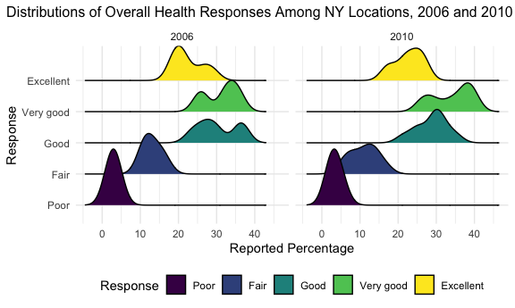

P8105 Homework 3
================
Courtney Diamond
2023-10-14

Let’s start by loading our libraries and creating some default settings.

## Question 1

Great. Let’s load our first dataset.

``` r
data("instacart")

instacart = 
  instacart |>
  as_tibble()
```

We are looking at a dataset of 1384617 observations and 15 variables,
all relating to orders from Instacart. The variables include:

- `order_id`: the unique identifier of the order
- `product_id`: the unique identifier of the product
- `add_to_cart_order`: the order in which the item was placed into the
  cart
- `reordered`: an indicator of whether or not the product is a repeat
  order
- `user_id`: a user’s unique identifier
- `eval_set`: whether the observation is part of a training or test set
  for some model
- `order_number`: for a specific user, the sequence of the whole order
  in relation to all orders made
- `order_dow`: which day of the week the order was placed
- `order_hour_of_day`: which hour of the day the order was placed
- `days_since_prior_order`: number of days since the user’s last order
- `product_name`: the human-readable product name
- `aisle_id`: the unique identifier of the aisle the product is in
- `department_id`: the unique identifier of the department the product
  is in
- `aisle`: the human-readable name of the aisle the product is in
- `department`: the human-readable name of the department the product is
  in

Each individual line or observations corresponds to a specific product
in a specific order by a specific user, and contains additional details
about the order and product. Let’s walk through the first line.
`order_id` is 1; this represents a single order by a single user, and is
the only order in the dataset with this ID. `product_id` is the product
in question; the corresponding human-readable name is in the
`product_name` column. The `add_to_cart_order` tells us that this
product was the very first thing the person put in their cart when
building this order, and `reordered` tells us whether or not the person
ordered the product before (in this case, yes). The `user_id` is 112108;
all of this person’s orders and products will have this value.
`eval_set` doesn’t give us information about the order or product, but
rather what the downstream use of the observation is for: in this case,
it will be part of the end-user’s training set for a given ML or other
model. `order_number` tells us that this is the fourth order for this
individual user, and `order_dow` tells us which day of the week the
order was placed on (but there’s no data to tell us which day the 4th
day of the week is, so it’s a little hard to interpret).
`order_hour_of_day` tells us they ordered this sometime between 10AM and
11AM (presuming they’re using standard military time). We can see that
there have been 9 days since the user’s last order, as indicated by the
`days_since_prior_order` column. We’ve already covered that the
`product_name` is the human readable version of the `product_id`, so in
this case we’re looking at some Bulgarian yogurt; `aisle_id` and
`department_id` tell us that this is found in a specific aisle and
department; the corresponding `aisle` and `department` variables tell us
in human-readable terms that we can find this product in the yogurt
aisle of the “dairy eggs” department.

Let’s do some tidying! I don’t think we need the `eval_set` variable
(the online description notes we are only working with training
observations here, and none of the questions I have pertain to this).
I’m also going to reorder so similar variables are grouped together, and
recode the `reordered` variable to “yes” and “no” to make it more
obvious to a human reader. I’ll hold off on recoding the `order_dow`
variable because there’s no definitive answer in the original README
file online about which number corresponds to which day.

``` r
tidy_instacart = 
instacart |> 
  select(!eval_set) |> 
  relocate(order_id,
           user_id,
           order_number,
           order_dow,
           order_hour_of_day,
           days_since_prior_order,
           add_to_cart_order,
           reordered,
           product_id,
           product_name,
           aisle_id, aisle,
           department_id,
           department) |> 
  mutate(
    reordered = 
      case_match(
        reordered,
        1 ~ "yes",
        0 ~ "no"), 
    reordered = 
      as.factor(reordered))
```

First up, we want to know how many aisles there are. We can establish
this by calling `group_by(aisle_id)`, and figuring out how many groups
are consequently made. We end up with 134 aisles.

``` r
tidy_instacart |> 
  group_by(aisle_id) |> 
  n_groups()
```

    ## [1] 134

We also want to know which aisles have the most products ordered from
them! I am going to interpret this as raw counts represented by the
number of times a product is listed in the table, and NOT group by the
item itself as a conceptual level. (That is, if there are 1,000,000 rows
corresponding to 1 type of ice cream, I will count each of those
individually, and not simply as 1 product.) We end up with the fresh
vegetables aisle having the most products ordered (150609), followed by
the fresh fruits with 150473 products, and the packaged vegetables
fruits taking third place with 78493 products.

Great- now let’s graph it!

``` r
tidy_instacart |> 
  count(aisle) |> 
  filter(n > 10000) |> 
  mutate(aisle = 
           fct_reorder(aisle, n, desc)) |> 
  ggplot(aes(x = aisle, y = n)) + 
  geom_point() +
  theme(axis.text.x = element_text(angle = 60, hjust = 1)) +
  labs(title = "Number of Products Ordered from Each Aisle")
```


Now we want to examine a few aisles more closely.

``` r
tidy_instacart |> 
  filter(aisle == "baking ingredients" | aisle == "dog food care" | aisle == "packaged vegetables fruits") |> 
  count(aisle, product_name) |> 
  group_by(aisle) |> 
  arrange(desc(n)) |> 
  mutate(rank = min_rank(desc(n))) |> 
  filter(rank < 4) |> 
  select(!rank) |>  
  knitr::kable()
```

| aisle                      | product_name                                  |    n |
|:---------------------------|:----------------------------------------------|-----:|
| packaged vegetables fruits | Organic Baby Spinach                          | 9784 |
| packaged vegetables fruits | Organic Raspberries                           | 5546 |
| packaged vegetables fruits | Organic Blueberries                           | 4966 |
| baking ingredients         | Light Brown Sugar                             |  499 |
| baking ingredients         | Pure Baking Soda                              |  387 |
| baking ingredients         | Cane Sugar                                    |  336 |
| dog food care              | Snack Sticks Chicken & Rice Recipe Dog Treats |   30 |
| dog food care              | Organix Chicken & Brown Rice Recipe           |   28 |
| dog food care              | Small Dog Biscuits                            |   26 |

Now let’s look at a couple of specific products.

``` r
tidy_instacart |> 
  filter(product_name == "Pink Lady Apples" | product_name == "Coffee Ice Cream") |> 
  group_by(product_name, order_dow) |> 
  summarize(mean_hour = mean(order_hour_of_day)) |> 
  pivot_wider(names_from = order_dow,
              values_from = mean_hour) |> 
  knitr::kable()
```

    ## `summarise()` has grouped output by 'product_name'. You can override using the
    ## `.groups` argument.

| product_name     |        0 |        1 |        2 |        3 |        4 |        5 |        6 |
|:-----------------|---------:|---------:|---------:|---------:|---------:|---------:|---------:|
| Coffee Ice Cream | 13.77419 | 14.31579 | 15.38095 | 15.31818 | 15.21739 | 12.26316 | 13.83333 |
| Pink Lady Apples | 13.44118 | 11.36000 | 11.70213 | 14.25000 | 11.55172 | 12.78431 | 11.93750 |

## Question 2

First up: loading and cleaning data!

``` r
data("brfss_smart2010")

brfss_df = brfss_smart2010 |> 
  as_tibble()

tidy_brfss = 
  brfss_df |> 
  janitor::clean_names() |> 
  rename(location_abbr = locationabbr,
         location_desc = locationdesc,
         ) |> 
  filter(topic == "Overall Health") |> 
  mutate(response =
           forcats::fct_relevel(response, c("Poor", "Fair", "Good", "Very good", "Excellent")))
```

### Question 2A

In 2002, only 6 states had more than 7 locations polled. This compares
to 14 states in 2010.

To get these values, I filtered first to the year desired, then got the
counts of all the occurrences of a given state `location_abbr`. Because,
for this specific question, there will always be five observations for
the same site (one corresponding to each of the potential responses), I
need to account for this when filtering by counts; I adjust the desired
threshold of 7 by multiplying by 5. Finally, I call `nrow()` to get the
number of states that are pulled back by the above filter.

### Question 2B

``` r
tidy_brfss |> 
  filter(response == "Excellent") |> 
  group_by(year, location_abbr) |> 
  summarize(n = n(), average_state_prevalence = mean(data_value)) |> 
  ggplot(aes(x = year, y = average_state_prevalence, color = fct_reorder(location_abbr, average_state_prevalence))) +
  geom_line() + 
  labs(
    title = "Average Percentage of Self-Reported Excellent Health by State, 2002-2010",
    x = "Year",
    y = "Prevalence",
    color = "State"
  ) + 
  theme(plot.title = element_text(size = 12), plot.title.position = "plot")
```

    ## `summarise()` has grouped output by 'year'. You can override using the
    ## `.groups` argument.


Spaghetti plots are very scary to look at when you want to identify the
trend for an individual observation across time; however, they’re great
for assessing overall trends without losing the granularity of
individual trends. For this question, I originally did not refactor any
variables and got a plot that was overwhelming to look at; while the
legend was in alphabetical order by state, trying to find an individual
state by its own shade on the color palate is nearly impossible because
the shades are so close to one another. Instead, I decided to refactor
the variable corresponding to state (`location_abbr`) based on the value
of the `average_state_prevalence`, which now organizes my color palate
with respect to the percentage we’re interested in learning. It’s easier
for me to see that DC is one of the yellow lines, and therefore one of
the locations reporting the highest rates of “Excellent” health, and WV
is one of the dark purple lines, and therefore has one of the lowest
reported rates. In this case, the legend is almost more informative than
the graph itself.

### Question 2C

``` r
tidy_brfss |> 
  filter(year == 2006 | year == 2010) |> 
  filter(location_abbr == "NY") |> 
  group_by(year, response) |> 
  ggplot(aes(x = data_value, fill = response)) +
  geom_density(alpha = .5) +
  facet_grid(~year) + 
  labs(
    title = "Distributions of Overall Health Responses Among NY Locations, 2006 and 2010",
    x = "Reported Percentage",
    y = "Density",
    fill = "Response"
  ) +
  theme(plot.title = element_text(size = 12), plot.title.position = "plot")
```


``` r
tidy_brfss |> 
  filter(year == 2006 | year == 2010) |> 
  filter(location_abbr == "NY") |> 
  group_by(year, response) |> 
  ggplot(aes(x = response, y = data_value)) +
  geom_boxplot() +
  facet_grid(~year) +
  labs(
    title = "Distributions of Overall Health Responses Among NY Locations, 2006 and 2010",
    x = "Response",
    y = "Reported Percentage"
  ) + 
  theme(plot.title = element_text(size = 12), plot.title.position = "plot",
        axis.text.x = element_text(angle = 60, hjust = 1))
```



``` r
tidy_brfss |> 
  filter(year == 2006 | year == 2010) |> 
  filter(location_abbr == "NY") |> 
  group_by(year, response) |> 
  ggplot(aes(x = response, y = data_value)) + 
  geom_violin(aes(fill = response))+
  facet_grid(~year) + 
  stat_summary(fun = "mean")
```


``` r
tidy_brfss |> 
  filter(year == 2006 | year == 2010) |> 
  filter(location_abbr == "NY") |> 
  group_by(year, response) |> 
  ggplot(aes(x = data_value, y = response)) +
  geom_density_ridges(aes(fill = response)) +
  facet_grid(~year)
```

    ## Picking joint bandwidth of 2.1

    ## Picking joint bandwidth of 2.03


I generated two plots for this question, and I think each of them has
their own merit depending on what the reader is looking for from a
visualization of this data. The first plot is a density plot, and
provides a good “quick” visual that generally shows us how the
distributions differed between the two time points, but the boxplot
provides more information about the mean, IQR, and outliers and is
(probably) preferred by those who really want to extract these details
from a visual.

## Question 3

``` r
nhanes_accel = read_csv("data/nhanes_accel.csv") |> 
  janitor::clean_names()
```

    ## Rows: 250 Columns: 1441
    ## ── Column specification ────────────────────────────────────────────────────────
    ## Delimiter: ","
    ## dbl (1441): SEQN, min1, min2, min3, min4, min5, min6, min7, min8, min9, min1...
    ## 
    ## ℹ Use `spec()` to retrieve the full column specification for this data.
    ## ℹ Specify the column types or set `show_col_types = FALSE` to quiet this message.

``` r
nhanes_covars = read_csv("data/nhanes_covar.csv", 
                         skip = 4) |> 
  janitor::clean_names() |> 
  mutate(sex = 
         case_match(
           sex,
           1 ~ "male",
           2 ~ "female"),
         education = 
           case_match(
             education,
             1 ~ "Less than high school",
             2 ~ "High school equivalent",
             3 ~ "More than high school"
           ), 
         sex = as.factor(sex), 
         sex = fct_relevel(sex,
                           c("male",
                             "female")),
         education = as.factor(education),
         education = fct_relevel(education,
                                 c("Less than high school",
                                 "High school equivalent",
                                 "More than high school"))
                              )
```

    ## Rows: 250 Columns: 5
    ## ── Column specification ────────────────────────────────────────────────────────
    ## Delimiter: ","
    ## dbl (5): SEQN, sex, age, BMI, education
    ## 
    ## ℹ Use `spec()` to retrieve the full column specification for this data.
    ## ℹ Specify the column types or set `show_col_types = FALSE` to quiet this message.

``` r
nhanes_combined = full_join(nhanes_covars, nhanes_accel, by = "seqn") |> 
  filter(age > 21) |> 
  drop_na(sex, age, bmi, education)
```

### Question 3A

``` r
nhanes_combined |> 
  count(sex, education) |> 
  pivot_wider(names_from = sex,
              values_from = n) |> 
  knitr::kable()
```

| education              | male | female |
|:-----------------------|-----:|-------:|
| Less than high school  |   27 |     28 |
| High school equivalent |   34 |     23 |
| More than high school  |   54 |     59 |

``` r
nhanes_combined |> 
  group_by(sex, education) |> 
  ggplot(aes(x = education, y = age, fill = sex)) + 
  geom_boxplot() +
  labs(
    title = "NHANES Accelerometer Age Distrubtions by Sex and Education Level",
    x = "Highest Education Level",
    y = "Age",
    fill = "Sex"
  ) +
  theme(plot.title = element_text(size = 12), plot.title.position = "plot")
```


### Question 3B

``` r
nhanes_combined |> 
  mutate(
    total_activity_sum = 
      rowSums(
        across(
          c("min1":"min1440")
          )
        ),
    mean_activity = 
      rowMeans(
        across(
          c("min1":"min1440")
        )
      )
    ) |> 
  group_by(sex, education) |> 
  ggplot(aes(x = age, y = mean_activity, color = sex)) +
  geom_point() +
  geom_smooth(se = FALSE) +
  facet_grid(~education) +
  labs(
    title = "Mean Activity Level vs Age by Sex and Education Level ",
    x = "Age",
    y = "Mean Activity Level (in MIMS)",
    color = "Sex"
  ) +
  theme(plot.title = element_text(size = 12), plot.title.position = "plot")
```

    ## `geom_smooth()` using method = 'loess' and formula = 'y ~ x'


### Question 3C

``` r
nhanes_combined |> 
  pivot_longer("min1":"min1440", 
               names_to = "minute",
               names_prefix = "min",
               values_to = "mims") |> 
  mutate(minute = 
           as.integer(minute)) |> 
  group_by(sex, education, minute) |> 
  summarize(mean_mims = mean(mims)) |> 
  mutate(time_of_day = 
           hms::hms(minutes = minute)) |>
  ggplot(aes(x = time_of_day, y = mean_mims, color = sex)) +
  geom_smooth(se = FALSE) + 
  facet_grid(~education) +
  labs(
    title = "24-hour Activity Levels by Sex and Education Levels",
    x = "Time of Day (hh:mm:ss)",
    y = "Mean Activity Level (in MIMS)",
    color = "Sex"
  ) +
  theme(plot.title = element_text(size = 12), plot.title.position = "plot")
```

    ## `summarise()` has grouped output by 'sex', 'education'. You can override using
    ## the `.groups` argument.
    ## `geom_smooth()` using method = 'gam' and formula = 'y ~ s(x, bs = "cs")'


